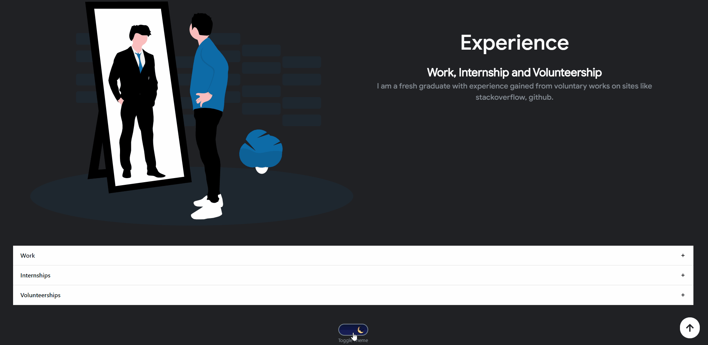

<a href="https://hits.seeyoufarm.com"></a>

Please give a star and link to this repo in your website, so that the project can grow.

<p align="center"> 
    <a href="https://tasin5541.github.io" target="_blank">
    </img>
    </a>
</p>

# Demo
To view a live demo, **[click here](https://tasin5541.github.io/)**

# Toggle Theme
<p align="center"> 
    </img>
</p>

# How to use

- Remove `<meta http-equiv="refresh" content="0;url=https://tasin5541.github.io/" />` in the `index.html` file
- You'll need [Git](https://git-scm.com) and [Node.js](https://nodejs.org/en/download/) (which comes with [npm](http://npmjs.com)) installed on your computer 
- Create a repository in github named username.github.io (your github username in place of username)
- Open up cmd/powershell in admin mode and enter the following line to download this repository

  - ```python
     git clone https://github.com/Tasin5541/portfolio.git
    ```
- Then go to `C:\Windows\System32\portfolio` in your File Explorer
- Delete the `.git` file
- Open `package.json` and add your repository name ("https://your_github_username.github.io") to the homepage section

  - ```python
     "homepage": "https://username.github.io"
    ```
    
- Create a file called .env in the root directory of your project, typw the following in cmd/powershell

  - ```bash
    cp env.example .env
    ```

- Inside the .env file, add key `REACT_APP_GITHUB_TOKEN` and assign your github token like this.

  - ```javascript
     // .env
      REACT_APP_GITHUB_TOKEN = "YOUR GITHUB TOKEN HERE"
    ```

You can get a github token as described [here](https://docs.github.com/en/github/authenticating-to-github/creating-a-personal-access-token). Give all permissions while generating token. Also add your `githubUserName` in the correct field inside `git_data_fetcher.js`.

- You will find `git_data_fetcher.js` file in the main directory of the repository. This file is used to fetch the data (Pull requests, Issues, Organizations, Pinned projects etc.) from your github.
If you open the file, you will see below component at the top of the file. You need to change only that component.

  - ```python
    const openSource = {
      githubUserName: "Your Github Username Here.",
    };
    ```
- Navigate to `C:\Windows\System32\portfolio\src` and open the `portfolio.js` file to change your information
- Type the following lines in cmd/powershell one by one and press enter after each line
 
  - ```python
     cd portfolio
     
     npm install
     
     node git_data_fetcher.js
     
     npm build
     
     #To view the website in localhost before deploying
     npm start
     #press ctrl+c in cmd to stop the localhost if you executed the last command
     
     #Deploy to github
     cd build
     
     git init
     
     #Use your github username
     git remote add origin https://github.com/username/username.github.io.git
     
     git add .
     
     git commit -m 'deploy'
     
     git push -u origin master
    ```
 - You're all set, now visit "username.github.io" to see your website
 - Note: You'll need to copy the `.git` file inside build folder and save it elsewhere. Everytime you update any information run `npm build` and copy the `.git` back into build folder before continuing with `git add .` and the rest of the commands. Remember to copy the `.git` everytime you run `npm build`

# References 👏🏻

- Some Design and Implementation Ideas are taken from [Saad Pasta's Portfolio Project](https://github.com/saadpasta/developerFolio) and [ashutosh1919 masterPortfolio Project](https://github.com/ashutosh1919/masterPortfolio).
